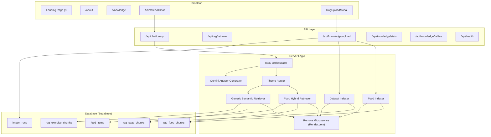

# Project Blueprint – Architektur & Design

> Technische Architektur-Dokumentation des Everlast RAG-Systems.

---

## 1. System-Architektur

## 2. Design-Entscheidungen

### Dedizierter Microservice statt Serverless-Embeddings
- **Warum**: Netlify Lambda (Serverless) unterstützt das Ausführen nativer ONNX-Binaries (für `@xenova/transformers`) nicht. Externe APIs (wie HuggingFace) haben Rate-Limits oder verlangen Authentifizierung.
- **Wie**: Ein minimaler Node/Express-Container auf Render.com führt `@xenova/transformers` (`all-MiniLM-L6-v2`, 384 Dimensionen) performant aus. Die Next.js App kommuniziert via REST-API.
- **Vorteil**: Keine Re-Indexierung der bestehenden 50.000+ Supabase-Einträge nötig, da exakt das gleiche Modell verwendet wird. Die Haupt-App auf Netlify ist extrem entlastet.

### Hybrid-Retrieval für Food
- **Trigram-Suche** (`pg_trgm`): Exakte/fuzzy Namens-Matches
- **Semantische Suche** (pgvector): Bedeutungs-basierte Ähnlichkeit
- **Merge & Rerank**: Ergebnisse beider Quellen werden dedupliziert und nach Score sortiert

### Gemini für Generierung
- REST-API Anbindung (kein SDK, minimale Dependencies)
- System-Prompt mit Kontext-Chunks für factual grounding
- Structured Output für Tabellen bei Food-Queries

### SSE-Streaming für Uploads
- Echtzeit-Fortschritt via Server-Sent Events
- Client sieht: Parsing → Format-Erkennung → Embedding → Indexierung
- Terminal-Log im Upload-Modal für Debugging

### Theme-basiertes Routing
- `ThemeKey` (`food` | `saas_docs` | `exercises`) bestimmt:
  - Welche Tabelle abgefragt wird
  - Welcher Retriever genutzt wird
  - Welche RPC aufgerufen wird
- Neue Themes erfordern nur: Tabelle + RPC + Eintrag in `themeRegistry`

## 3. API-Contracts (Zod)

Alle API-Ein- und Ausgaben sind via Zod-Schemas typsicher definiert:

| Schema | Verwendung |
|---|---|
| `chatQueryRequestSchema` | POST /api/chat/query – Frage + Theme + TopK |
| `retrievalRequestSchema` | POST /api/rag/retrieve – Frage + Theme + TopK |
| `healthResponseSchema` | GET /api/health – Status + Features |
| `themeKeySchema` | enum: saas_docs, food, exercises |

## 4. Datenbank-Design

### Tabellen-Überblick

| Tabelle | Zweck | Besonderheit |
|---|---|---|
| `food_items` | Normalisierte Lebensmittel | Trigram-Index auf `search_text` |
| `rag_food_chunks` | Food-Embedding-Chunks | HNSW-Index, `food_item_id` FK |
| `rag_saas_chunks` | SaaS-Hilfe-Chunks | HNSW-Index |
| `rag_exercise_chunks` | Übungs-Chunks | HNSW-Index, Bilder in metadata |
| `import_runs` | Import-Tracking | Status, Statistiken |
| `import_errors` | Fehler pro Import | FK auf import_runs |

### RPCs

| Funktion | Zweck |
|---|---|
| `match_rag_food_chunks` | Semantische Food-Suche |
| `match_rag_saas_chunks` | Semantische SaaS-Suche |
| `match_rag_exercise_chunks` | Semantische Exercise-Suche |
| `search_food_items_lexical` | Trigram-Suche auf food_items |
| `get_rag_tables` | Alle rag_*_chunks Tabellen + Row-Counts |

## 5. UI-Design

- **Dark/Light Mode** via CSS Custom Properties + `next-themes`
- **Animationen**: Framer Motion für Sidebar, Dropdowns, Chat-Typing
- **Responsive**: Desktop-Sidebar (collapsible) + Mobile-Drawer
- **Premium-Design**: Glassmorphism, Gradients, Micro-Animations

## 6. Erweiterbarkeit

### Neues Theme hinzufügen
1. Migration: neue `rag_<name>_chunks` Tabelle + `match_rag_<name>_chunks` RPC
2. `themeRegistry` in `theme-router.ts` erweitern
3. `themeKeySchema` in `schemas.ts` erweitern
4. Fertig — Upload, Retrieval, Chat funktionieren automatisch

### Anderen Embedding-Provider nutzen
1. Neue Klasse die `EmbeddingProvider` implementiert
2. In den Retrievern und Indexern austauschen
3. Dimensionen in Migrations anpassen
